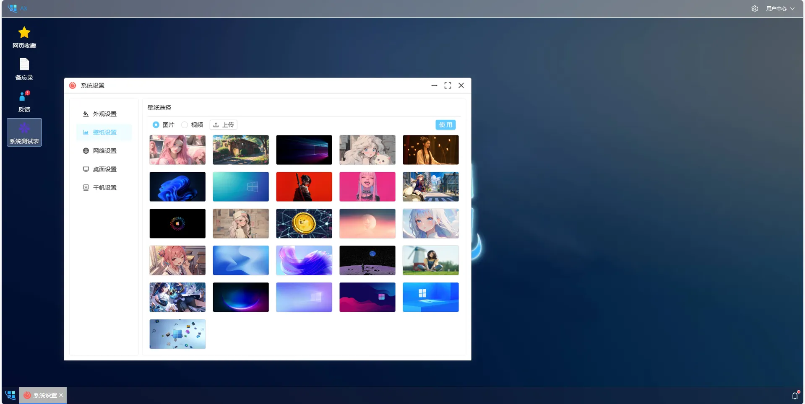
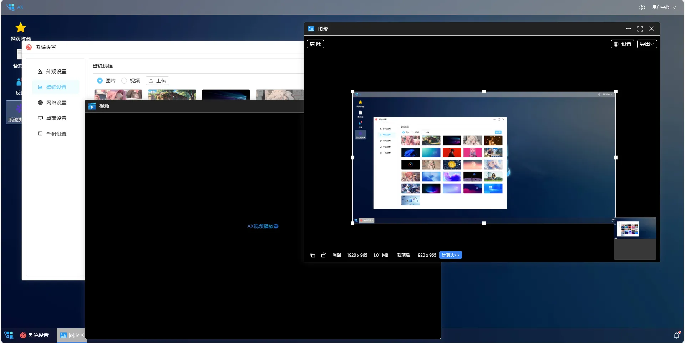

<div align="center"><h1 align="center">AX</h3></div>
<div align="center"><h3 align="center">Windows 操作风格的后台管理系统</h3>
</div>

<p align="center">     
    <p align="center">
        <a>
            
        </a>
        <a href="https://gitee.com/in-git/ax.git">
            
        </a>
        <a href="https://gitee.com/in-git/ax">
            
        </a>
    </p>
</p>


#### 前言

网上有不少仿windows的项目，但基本上都是demo，没有多大实际意义。而AX是一款具备windows操作风格，而且能投入生产的管理系统。当前为基础版，没有绑定任何业务。

#### 功能

1. 后端fork自若依，数据有所改动，前端界面，交互完全重构

2. 新注册的用户为访客，能使用备忘录，网页收藏，反馈功能，用户数据独立

3. ```
   `观察者账号： observer
   `观察者密码： axobserver
   `观察者能看到整个系统的功能，但不能进行任何操作
   ```

#### 预览





#### 本地功能

```
这些功能的配置属性存储在本地，不会影响到云端服务器数据
```

- ###### 系统设置

  1. 外观设置

     - [x] 模式切换：黑暗模式，默认亮色，紧凑模式
     - [x] 框架自带功能：水波纹特效，虚拟滚动，控件大小，主题颜色，文字方向
     - [x] 全局设置：字体大小，边框圆角

  2. 网络设置

     - [x] 选择服务器：可视化切换服务器，无需修改代码
     - [x] 超时管理：可视化配置timeout的时间
     - [x] token:本地token可视化展示

  3. 桌面设置

     1. 背景模糊，透明度，明亮度配置

  4. 第三方接口

     - [x] pexels:配置壁纸

  5. AI配置

     > 实验性功能，前端可视化配置AI接口，可用AI发送请求，处理业务

     - [x] 百度千帆：接入AI处理

- ###### AI对话

  > 使用千帆大模型

  - [x] 记忆功能：开启/关闭聊天记录
  - [x] 拖拽功能：输入框可拖拽大小
  - [x] 超时提醒：记录发送的毫秒
  - [x] 系统调用：可通过其他应用程序调用

- ###### 记事本

  - [x] 任务多开：可打开多个记事本，其他系统应用一般为单开，主要原因是多开的程序组件传值较为麻烦，目前没法降低代码的复杂度

  - [x] AI调用：可调用AI

  - [x] 二维码生成

  - [x] 本地文件读写

    > - [ ] 只能在localhost或http下使用
    > - [ ] 实验性功能，部分浏览器可能不兼容

- ###### 表单功能

  - [x] 字段筛选：可动态配置表头，自带记忆
  - [x] 模式切换：提供表格模式，卡片模式，卡片模式部分内容可能要修改代码
  - [x] 搜索记忆：记录用于曾经搜索过的内容，可快速方便的录入
  - [x] 快捷方式
    1. 双击卡片内容编辑
    2. 双击表单内容编辑

#### 系统功能

```
这些配置可能会影响到其他用于，或者系统运行
```
