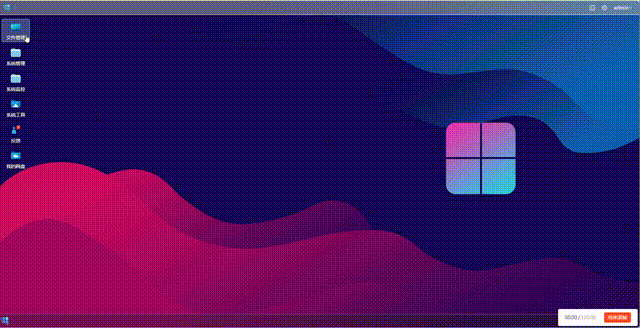
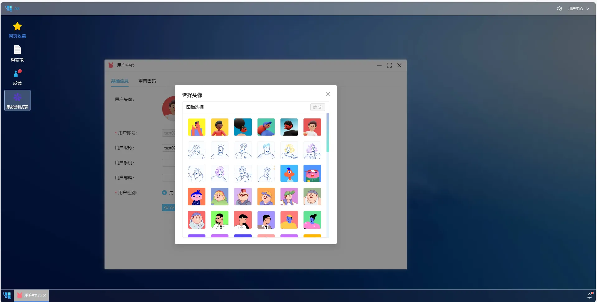
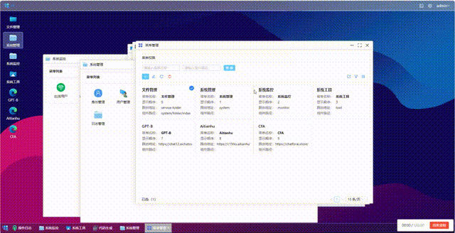

<div align="center"><h1 align="center">AX</h3></div>
<div align="center"><h3 align="center">Windows 操作风格的后台管理系统</h3>
</div>
<p align="center">     
    <p align="center">
        
        
        
    </p>
</p>


#### 项目前言

AX是浏览器上的 `Windows `，可管理远程服务器上的文件，具备完整的权限管理。使用Vue3/Java实现，后端fork自若依，快速生成增删改查代码


#### 在线体验

电脑设备/移动设备 项目完全独立，不采用响应式，表格无法在移动端有很好的展现效果

电脑端采用Windows设计风格

移动端采用安卓风格【正在开发中...】

电脑端：<a href=http://150.158.14.110:8000/ target=_blank>电脑端</a>

移动端：<a href="http://150.158.14.110:8001/" target=_blank>移动端</a>


####  内置功能

1. 用户管理：用户是系统操作者，该功能主要完成系统用户配置。
2. 部门管理：配置系统组织机构（公司、部门、小组），树结构展现支持数据权限。
3. 岗位管理：配置系统用户所属担任职务。
4. 菜单管理：配置系统菜单，操作权限，按钮权限标识等。
5. 角色管理：角色菜单权限分配、设置角色按机构进行数据范围权限划分。
6. 字典管理：对系统中经常使用的一些较为固定的数据进行维护。
7. 参数管理：对系统动态配置常用参数。
8. 通知公告：系统通知公告信息发布维护。
9. 操作日志：系统正常操作日志记录和查询；系统异常信息日志记录和查询。
10. 登录日志：系统登录日志记录查询包含登录异常。
11. 在线用户：当前系统中活跃用户状态监控。
12. 定时任务：在线（添加、修改、删除)任务调度包含执行结果日志。
13. 代码生成：前后端代码的生成，支持CRUD下载 。
14. 服务监控：监视当前系统CPU、内存、磁盘、堆栈等相关信息。
15. 缓存监控：对系统的缓存信息查询，命令统计等。
16. 在线构建器：拖动表单元素生成相应的HTML代码。

#### 关于仓库

##### GITCODE 安装

```
git clone https://gitcode.com/in-git/ax.git
```

##### GITEE 安装

```
git clone https://gitee.com/in-git/ax.git
```

##### 子仓库

- 该项目下有多个子仓库，按需克隆下载
- resource：静态资源，图片，帮助信息目录
- web-vue3：前端代码
- backend：后端java代码
- nodejs：辅助开发后端

>如果是首次接触AX，可以先装前端。后端地址、静态资源地址能在界面切换

#### 项目预览








#### 关于后端

1. 后端在若依的源码上有增加，基本兼容若依
2. 数据库选择  ax/backend/sql/ax.sql，开放派，解封AX所有能力
3. 数据库选择  ax/backend/sql/ry.sql，保守派，仅有若依的功能
4. 暂时没有做低代码生成的教程，流程与若依一致，前往查看 https://doc.ruoyi.vip/


#### 关于前端

1. 尽可能的不更改系统内置的功能代码
2. 窗口传值项目中有示例，暂不支持多窗口，目前没法降低代码复杂程度，如有需要，参照记事本的实现。
3. 代码生成参照系统测试表，根据菜单管理中的组件路径读取对应文件，目录正确即可，无需手动导入
4. 任何业务逻辑都需要写到窗口中

#### 关于资源

- AX的图片资源，前端代码，后端代码是完全分离的，这是一次大胆的尝试
- 图片资源能托管到github、nginx、自定义服务器上，在界面能自由切换
- 图片，头像等资源可任意添加，删除，修改，前端能选择，读取
- 静态资源将被头像选择器，背景选择，图片选择器使用
- 如果对版权有要求，请务必将 resource 仓库中所有图片替换成自定义的图片，再重新生成JSON
- 所有图片资源来源于网络


#### 本地功能

```
这些功能的配置属性存储在本地，不会影响到云端服务器数据
```

- ###### 系统设置

  1. 外观设置

     - [x] 模式切换：黑暗模式，默认亮色，紧凑模式
     - [x] 框架自带功能：水波纹特效，虚拟滚动，控件大小，主题颜色，文字方向
     - [x] 全局设置：字体大小，边框圆角

  2. 网络设置

     - [x] 选择服务器：可视化切换服务器，无需修改代码
     - [x] 超时管理：可视化配置timeout的时间
     - [x] token:本地token可视化展示

  3. 桌面设置

     1. 背景模糊，透明度，明亮度配置

  5. AI配置

     > 实验性功能，前端可视化配置AI接口，可用AI发送请求，处理业务

     - [x] 百度千帆：接入AI处理

- ###### AI对话

  > 使用千帆大模型

  - [x] 记忆功能：开启/关闭聊天记录
  - [x] 拖拽功能：输入框可拖拽大小
  - [x] 超时提醒：记录发送的毫秒
  - [x] 系统调用：可通过其他应用程序调用

- ###### 记事本

  - [x] 任务多开：可打开多个记事本，其他系统应用一般为单开
  
- [x] AI调用：可调用AI
  - [x] 二维码生成

- ###### 表单功能

  - [x] 字段筛选：可动态配置表头，自带记忆
  - [x] 模式切换：提供表格模式，卡片模式，卡片模式部分内容可能要修改代码
  - [x] 搜索记忆：记录用于曾经搜索过的内容，可快速方便的录入
  - [x] 快捷方式
    1. 双击卡片内容编辑
    2. 双击表单内容编辑
